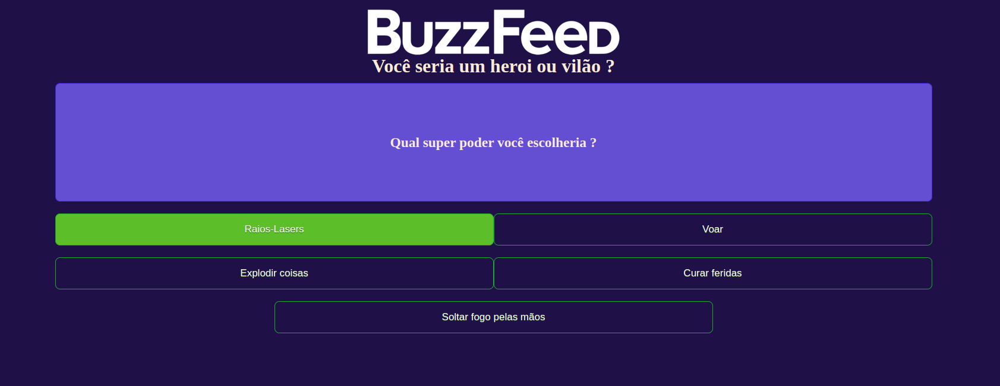

# Angular BuzzFeed

Criação de um clone do BuzzFeed com Angular.
##

| Angular    | Explorando o Angular Framework                   |
|------------|--------------------------------------------------|
| Módulo     | Criando um Clone do BuzzFeed com Angular         |
| Com        | Felipe Silva Aguiar                              |
| Bootcamp   | Desenvolvimento Frontend com Angular             |
| Plataforma | DIO                                              |

 

##
### Tecnologias utilizadas:

   
   
   
   

##

This project was generated with [Angular CLI](https://github.com/angular/angular-cli) version 16.0.2.
